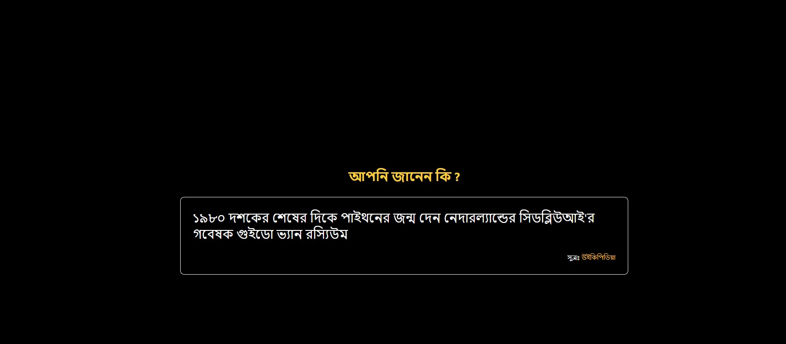

# Simple Google Chrome Extension 

This Chrome extension will show random tips and trics about in your new Chrome Tab
## Technology Used

. ### React
. ### HTML CSS


### How to Run 

1. Clone the Github Repository   
```
git clone https://github.com/meher09/random-tips-google-chrome-extension-with-react
```

2. change directory to Random Tips folder
3. Open it your visual studio code or your favourite code editor
4. run following code in terminal 
```
npm i
```
5. Run Following code in your terminal 
```
npm build
```
6. Eventually you will see a build folder
7. Open Google Chrome extension and turn on the developer mode
8. select folder from unpacked
9. Done 

## Screenshots

